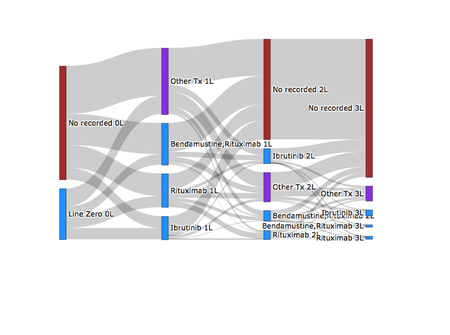
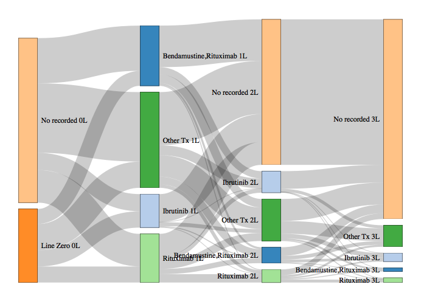

Using RochePlot::sankey
================

Get data
--------

For this example, I will use line data from Flatiron.

``` r
    library(dplyr)
```

    ## 
    ## Attaching package: 'dplyr'

    ## The following objects are masked from 'package:stats':
    ## 
    ##     filter, lag

    ## The following objects are masked from 'package:base':
    ## 
    ##     intersect, setdiff, setequal, union

``` r
    library(RochePlot)
    library(RocheTeradata)

    # data valid today
    valid_date <- Sys.Date()

    # connect to data
    tdRWDSconnect(
      datalab = FALSE,
      pwd = readLines("~/.ssh/.pass")
    )
```

    ## A teradataR connection is now live for blackj9 with no home datalab @rochetd.kau.roche.com.

    ## I gave you a teradataR style connection, the connection file is called tdConnection.

``` r
    d_LoT <- RocheTeradata::tdRWDSquery(
      "
      SELECT
      patientid
      ,LineName
      ,LineNumber
      ,IsMaintenanceTherapy
      FROM rwd_vdm_flatiron.v_cll_lineoftherapy
      WHERE
      VALID_START <= CAST('",paste0(valid_date," 00:00:00"),"' AS TIMESTAMP) AND
      VALID_END >= CAST('",paste0(valid_date," 00:00:00"),"' AS TIMESTAMP)
      ;"
    ) %>%
      filter(
        # just do lines 0 to 3
        LineNumber < 4 &
          # and ignore maintenence
          IsMaintenanceTherapy == "False"
      )
```

Using plotly
============

By default, the plot will use plotly to make the Sankey. E.g., the code below.

``` r
  sankey(
    dataframe = d_LoT,
    id = "PatientID",
    linename = "LineName",
    linenumber = "LineNumber",
    n_common = 3
  )
```

    ## Please manually validate the numbers - this function is unvalidated.



Look at the data
================

I can also just get the function to format the data, put not make the plot.

Here I save that formatted data into `d_plot`.

``` r
  d_plot <- sankey(
    dataframe = d_LoT,
    id = "PatientID",
    linename = "LineName",
    linenumber = "LineNumber",
    n_common = 3,
    return_data = TRUE
  )
```

    ## Please manually validate the numbers - this function is unvalidated.

``` r
 str(d_plot)
```

    ## List of 2
    ##  $ edges:'data.frame':   49 obs. of  5 variables:
    ##   ..$ source      : chr [1:49] "Bendamustine,Rituximab 1L" "Bendamustine,Rituximab 1L" "Bendamustine,Rituximab 1L" "Bendamustine,Rituximab 1L" ...
    ##   ..$ target      : chr [1:49] "Bendamustine,Rituximab 2L" "Ibrutinib 2L" "No recorded 2L" "Other Tx 2L" ...
    ##   ..$ value       : int [1:49] 39 142 805 165 16 11 52 168 71 6 ...
    ##   ..$ idnum_source: num [1:49] 0 0 0 0 0 1 1 1 1 1 ...
    ##   ..$ idnum_target: num [1:49] 1 4 8 11 14 2 5 9 12 15 ...
    ##  $ nodes:'data.frame':   16 obs. of  4 variables:
    ##   ..$ id_char  : chr [1:16] "Bendamustine,Rituximab 1L" "Bendamustine,Rituximab 2L" "Bendamustine,Rituximab 3L" "Ibrutinib 1L" ...
    ##   ..$ id_factor: Factor w/ 16 levels "Bendamustine,Rituximab 1L",..: 1 2 3 4 5 6 7 8 9 10 ...
    ##   ..$ id_num   : num [1:16] 0 1 2 3 4 5 6 7 8 9 ...
    ##   ..$ colour   : chr [1:16] "rgb(30,144,255)" "rgb(30,144,255)" "rgb(30,144,255)" "rgb(30,144,255)" ...

nodes
-----

There are two dataframes within the list returned. The first is the nodes.

``` r
  knitr::kable(
    d_plot$nodes %>% head(5),
    caption = "First 5 rows of 'nodes'"
  )
```

| id\_char                  | id\_factor                |  id\_num| colour          |
|:--------------------------|:--------------------------|--------:|:----------------|
| Bendamustine,Rituximab 1L | Bendamustine,Rituximab 1L |        0| rgb(30,144,255) |
| Bendamustine,Rituximab 2L | Bendamustine,Rituximab 2L |        1| rgb(30,144,255) |
| Bendamustine,Rituximab 3L | Bendamustine,Rituximab 3L |        2| rgb(30,144,255) |
| Ibrutinib 1L              | Ibrutinib 1L              |        3| rgb(30,144,255) |
| Ibrutinib 2L              | Ibrutinib 2L              |        4| rgb(30,144,255) |

edges
-----

Second is the edges.

``` r
  knitr::kable(
    d_plot$edges %>% head(5),
    caption = "First 5 rows of 'edges'"
  )
```

| source                    | target                    |  value|  idnum\_source|  idnum\_target|
|:--------------------------|:--------------------------|------:|--------------:|--------------:|
| Bendamustine,Rituximab 1L | Bendamustine,Rituximab 2L |     39|              0|              1|
| Bendamustine,Rituximab 1L | Ibrutinib 2L              |    142|              0|              4|
| Bendamustine,Rituximab 1L | No recorded 2L            |    805|              0|              8|
| Bendamustine,Rituximab 1L | Other Tx 2L               |    165|              0|             11|
| Bendamustine,Rituximab 1L | Rituximab 2L              |     16|              0|             14|

Different sankey wrapper
========================

Using the data returned - I can also try plotting the data using a different plotting function. E.g. here I use a more basic plotting function which is a simpler mapping to Bostock's D3.js library than the default plotly mapping.

``` r
  networkD3::sankeyNetwork(
    Links = d_plot$edges,
    Nodes = d_plot$nodes,
    Source = "idnum_source",
    Target = "idnum_target",
    Value = "value",
    NodeID = "id_char",
    units = "people", fontSize = 12, nodeWidth = 30
  )
```


